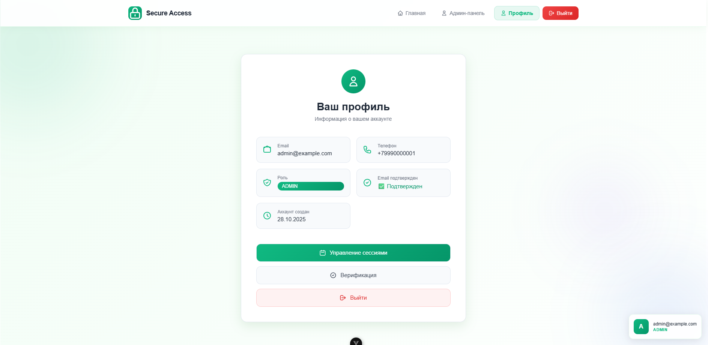

# Secure Access MVP - Фронтенд на Vue.js

## 📋 Описание проекта
Фронтенд-приложение для системы управления доступом и безопасностью (Secure Access MVP), созданное в рамках производственной практики. Приложение взаимодействует с mock-бекендом и реализует полный цикл работы с аутентификацией, сессиями и администрированием.
Единый пароль для всех пользователей: `SecurePass123!`

## 🚀 Быстрый старт

### Предварительные требования
- Node.js 16+
- npm или yarn

### Установка и запуск

1. Клонирование репозитория
git clone <репозиторий>
cd secure-access-frontend

2. Установка зависимостей в двух папках
npm install

3. Запуск проекта (фронтенд + mock-сервер)

- Mock-сервер `npm start`
- Фронтенд  `npm run dev`

## 🔐 Особенности аутентификации

### Срок жизни токенов
В системе реализована JWT-аутентификация со следующими сроками жизни токенов:

- **Access Token**: 60 минут
  - Используется для доступа к защищенным API-эндпоинтам
  - При истечении срока действия необходимо использовать refresh token для получения нового access token
  - После истечения refresh token пользователю нужно заново войти в систему

- **Refresh Token**: 7 дней
  - Используется для обновления access token без повторного ввода логина/пароля
  - Хранится в защищенном хранилище

**Важно**: Если access token истек и refresh token также недействителен или истек, пользователю необходимо перезайти в аккаунт для дальнейших действий.

## 🏗️ Архитектура проекта

### Стек технологий
- Vue 3 - Composition API
- Vue Router - навигация
- Pinia - управление состоянием
- Modern CSS - чистый CSS с анимациями
- JSON Server - mock-бекенд

## 🎯 Ключевые функции

### 🔐 Аутентификация и авторизация
- Регистрация с валидацией
- Вход по email/телефону
- JWT токены с автоматическим хранением
- Разделение ролей (user/admin)
- Автоматическое обновление токенов

### 👤 Управление профилем
- Просмотр профиля пользователя
- Управление сессиями
- Завершение конкретных сессий
- Выход со всех устройств

### 📱 Верификация
- Отправка кодов подтверждения
- Подтверждение email/телефона
- Mock-режим для тестирования (код отображается в ответе API)

### 🔧 Администрирование
- Просмотр аудит-логов (только для admin)
- Список всех пользователей
- Анализ security-событий

### 🔄 Восстановление доступа
- Запрос сброса пароля
- Установка нового пароля
- Защита от перебора

## 🔧 Особенности mock-бекенда

### Тестовые данные
Единый пароль для всех пользователей: `SecurePass123!`

### Тестовые пользователи
- Администратор: `admin@example.com`
- Обычные пользователи: генерируются автоматически при регистрации

### Особенности работы
- Автоматическая генерация - при регистрации создается новый пользователь
- Отладка в консоли - все запросы логируются для удобства тестирования
- Искусственная задержка - имитация реального API (50-250ms)
- Mock-коды верификации - код отображается в ответе API для тестирования
- JWT токены с реалистичными сроками жизни (60 минут для access, 7 дней для refresh)

## 📱 Страницы приложения

### Основные маршруты
- **Главная** (/) - информационная страница
- **Вход** (/login) - форма аутентификации
- **Регистрация** (/register) - создание аккаунта
- **Профиль** (/profile) - личный кабинет
- **Сессии** (/sessions) - управление активными сессиями
- **Верификация** (/verification) - верификация
- **Админ-панель** (/admin) - администрирование (только для admin)

### Дополнительные маршруты
- Восстановление пароля
- Подтверждение контактов
- Сброс пароля

## 🛠️ Команды разработки

# Запуск разработки (только фронтенд)
npm run dev

# Запуск mock-сервера (только бекенд)
npm start

## 📊 Обработка ошибок
Приложение включает комплексную обработку ошибок:

- Валидация форм на клиенте
- Обработка HTTP ошибок от API
- Пользовательские сообщения об ошибках

## 🎯 Покрытие ТЗ
Реализованные функции из ТЗ бекенда:

✅ Регистрация и вход
✅ JWT токены (access/refresh) с реалистичными сроками жизни
✅ Управление сессиями
✅ Восстановление пароля
✅ Верификация контактов
✅ RBAC (роли user/admin)
✅ Аудит событий (в админке)
✅ Правило "только свои данные"

## 📈 Производительность
- Минимальный бандл (Vue 3 tree-shaking)
- Ленивая загрузка маршрутов
- Оптимизированные анимации CSS
- Эффективное кэширование в localStorage
- Оптимизированные запросы к API

## 🔒 Безопасность
- Токены хранятся в localStorage с ограниченным сроком жизни
- Автоматическая очистка при истечении срока
- Защищенные маршруты (роутер guards)
- Валидация всех входящих данных
- Защита от CSRF и XSS атак
- Регулярное обновление токенов

## 📝 Примечания для тестирования

1. **Доступ к админ-панели**: 
   - Логин: `admin@example.com`
   - Пароль: `SecurePass123!`

2. **Тестирование истечения сессии**:
   - Access token живет 60 минут
   - После истечения срока нужно перезайти

3. **Отладка верификации**:
   - Коды подтверждения отображаются прямо в ответе API (поле `mock_code`)
   - Не требует реальной отправки SMS/email

4. **База данных**:
   - Все данные сохраняются в `db.json`
   - При перезапуске сервера данные сохраняются
   - Для сброса данных удалите `db.json`

## 🤝 Разработка

### Структура API
Все API эндпоинты начинаются с `/api/v1/`
- Аутентификация: `/api/v1/auth/*`
- Пользователи: `/api/v1/users/*`
- Администрирование: `/api/v1/admin/*`
- Верификация: `/api/v1/verifications/*`

### Работа с токенами
Фронтенд автоматически:
1. Добавляет access token в заголовки запросов
2. Обновляет токены при истечении через refresh token
3. Перенаправляет на страницу входа при полном истечении сессии

### Тестирование
Для тестирования всех сценариев используйте:
- Разные роли пользователей (user/admin)
- Истечение токенов (ждать 60 минут или модифицировать mock-сервер)
- Множественные сессии
- Верификацию контактов

